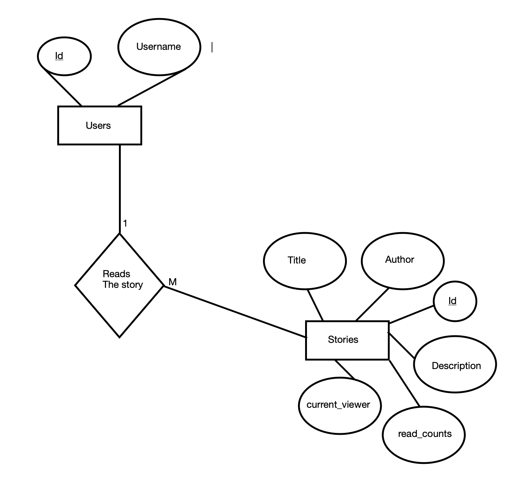

# ABOUT THE APPLICATION

**1. How to run the application**

1. Make sure you have Android Studio, Flutter and dart installed on your computers.
2. Make sure you have internet connectivity.
3. Clone the repository
4. Open in Android Studio by selecting - Open an Android Studio Project.
5. Connect your device to you computer.
6. Make sure the device has USB debugging on.
7. Run the program by clicking the green button on top.


# Documentation
This is a mobile Application that is developed using **Flutter as framework** and **cloud firestore as backend**.For, this particular project I used Cloud Firestore as my database since, we need to work with **realtime values** and it is what firestore does best.So,since it is a NoSql database, I worked with 2 Collections for this app specifically, namely : Stories and Users.

## Structure of Collections in database : 
**Stories**

```
Stories 
{
	“title” : Title of the story,
	“author”: Author of the story,
	“description”: Description of the story
	“id”: Every story has a unique id
	“read_counts”: Total number of people who have read the story,
	“current_viewer”: Total number of people currently viewing the story,
	ReadBy:{
		“id”:user's id,
		“read”:true
	}	
}
```

**Users**

```
Users
{
	“id”:<String>
	“username”:<String>
}

```

**Necessity of 'ReadBy' subcollection**

Necessity of ‘ReadBy’ Nested Collection in **Stories(parent collection)** is that this collection will *contain all the users that have read the document even once*, since the **task at hand is to consider multiple reads by the same person as 1**.So one can check in the collection before updating the `read_counts` criteria in the parent collection(Stories) whether a person currently viewing the story has already seen it before or is it his/her first time.


## Authentication

For authentication, Firebase authentication's **email+password verification method is used**.Since firebaseAuth detects `‘@‘` symbol to *recognise email* , we used it to our advantage and in email criteria we put in : `“XXXXXXXX@pratilipi.in”` ,[where XXXXXXX = username].

**To make a secure gateway , for login, I converted the password that were entered as plain strings into SHA-256 encryption using dart's *convert* and *crypto* packages respectively.**

**Encryption**

Used at the time of Sign up.
```
String encryptPassword(String passwrd){
      var bytes = utf8.encode(passwrd);
      var encPass = sha256.convert(bytes);
      return encPass.toString();
}
```

**Decryption**

Used at the time of Sign in.
```
String decryptPassword(String pw){
    var bytes = utf8.encode(pw);
    var decPass = sha256.convert(bytes);
    return decPass.toString();
}

```

# VARIABLE(IN DATABASE) DESCRIPTION TABLE

**Stories**

| Variables | Datatype | Description |
| :---      | :---     | :---        |
| id        | String   | story's id  |
| title     | String   | Title of story |
| author    | String   | Author of story |
| Description| String  | About the story |
| read_count| Number   | Total views on the story |
| current_viewers| Number | Current viewers |


**Users**

| Variables | Datatype | Description |
| :---      | :---     | :---        |
| userId    | String   | unique id of the user |
| username  | String   | username of the user |


# ER-DIAGRAM OF THE SYSTEM




# WORKING OF THE CURRENT VIEWING SYSTEM

To accomplish this feature, the moment a user enters the full Story view page, the **`current_viewing` parameter in the `story document` is incremented by 1** . But doing only, this does not accomplish our task. **We also need to show the currently viewing section as changing as soon as some other user starts reading it. In simpler words, reflect the change in our UI in realtime**. 
To accomplish this realtime change I used **StreamBuilder()** in flutter. *This takes a stream as parameter and builds the widget accordingly. Any changes in the stream are reflected in the builder*.

**Here is the flow of working for a more clearer understanding**


# WORKING OF THE TOTAL READ COUNT SYSTEM

This task was easy if and only if we had to just keep on adding 1 to the previous value of `read_counts` variable in the database. But the trick here was that if the *same user reads for more than 1 time, it will still be considered as 1*.
To accomplish this feature, **we made a *subcollection* in every story collection where we store the users who have read it or are reading it for the first time so that the next time they come back in we can cross check with this particular subcollection.**

**Here is the flow of working for a more clearer understanding**

### If the user is *found* in the subcollection : ###


### If the user is *not found* in the subcollection : ###


# SCREENSHOTS OF THE DATABASE #


# SCREENSHOTS OF WORKING APPLICATION #


| Login page | Sign up page |
| :---       | :---         |
|  |  | 

| Home page  | Full view page |
| :---       | :---           |
| |  |